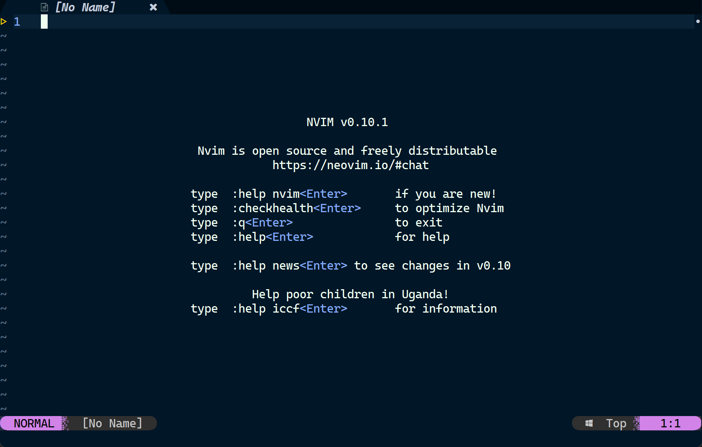

# Neovim
You must have installed git and neovim. That is a basic for everything.
you can click here to install.
---- [Git](https://git-scm.com/downloads)
---- [Neovim](https://neovim.io/) or you want to find it in GitHub [neovim/neovim](https://github.com/neovim/neovim)

# ;-)
<i>I suddenly think it will be anthor minimum...</i>

# NeoVim Config Start

A good start point to get into the `"evil"` world 😈️<br />

This is a config for nvim to be ready for starting.
Just some little settings.<br />

### Preview

This is a preview, I didn't use [dashbored.nvim]() or [alpha.nvim](), cuz I think it is like this very ok.
But if you want to DIY your own, it is really eazy to change. 

@> [!MESSAGE]
> I have seen the [yongtenglei/nvim_minimum](https://github.com/yongtenglei/nvim_minimum)
> and [yougtenglei/Neovim-QWERTY](https://github.com/yongtenglei/Neovim-QWERTY)

# Installation
You just download and copy the files to the config path.
Usually it is `~/AppData/Local/nvim/`, if you are windows user.
And it is `~/.config/nvim/`, if you are linux user.

You can download ZIP or clone like this:
```
git clone https://github.com/LightMist24/nvim_cfg.git
```
And then you can copy the files.

# Warning
In some files, you need to change the settings to fit you system.
some like this (Windows / Linux)<br />

./lua/core/settings.lua:
``` ./lua/core/settings.lua
68  -- vim.opt.undodir = vim.fn.expand("~/.config/nvim/.tmp/undo")
69  -- vim.opt.undodir = vim.fn.expand("~/AppData/Local/nvim_undo")
```
This is a setting that for nvim to save undo files.
You must have not want this file in some anthor path.
Right here. 68 line is for linux, and the other 69 is for windows.<br />

<del>There seems to be only one difference.</del>
Anthor:
./lua/core/keymaps.lua:
```
6  -- vim.keymap.set("n", "<leader>rc", ":e ~/.config/nvim/init.vim <cr>", opts)
7  -- vim.keymap.set("n", "<leader>rc", ":e ~/AppData/local/nvim/init.vim <CR>", opts)
```

There are also some setting for `neovide` in `./init.vim`. Actually I seldom use it, so I comment it. Just like this.<br />
``` ./init.vim
" Neovide setting
"lua vim.g.neovide_transparency = 0.8
"lua vim.g.neovide_cursor_vfx_mode = "railgun"
"""vim.g.neovide_cursor_vfx_mode = "ripple"
"lua vim.g.neovide_profiler=false
```
If you like to use neovide, you can use it.<br />

# Some settings to use
This mudule is for you to know some setting.<br />
But I recommend you read the source code directly in `./lua/core/` if you have much time and can do it, these are some basic config, such as moving cursor.<br />

|: Control | How to | Been set | Mode |
| -------- | ------ | -------- | ---- |
|: Move to header | `0` | `H` | Normal |
|: End of line | `#` | `L` | Normal |
|: Quick up | ` ` | `K` | Normal |
|: Quick Down | ` ` | `J` | Normal |
|: To command | `:` | `;` | Normal |
|: Quit Force | `:q!` | `QF` | Normal |
|: ESC | `ESC` | `jk` | Insert |
|: Move to header | `0` | `H` | Visual |
|: End of line | `#` | `L` | Visual |
|: ...... | ... | ... | ... |

And some for plugins:
@[hop.nvim](https://github.com/hadronized/hop.nvim):
|: Control | How to | Mode |
| -------- | ------ | ---- |
| Find char above | `SS` | Normal |
| FInd vhar below | `ss` | Normal |

@[telescope.nvim](https://github.com/nvim-telescope/telescope.nvim):
|: Control | How to | Mode |
| -------- | ------ | ---- |
| Find | `<leader>ff` | Normal |

......
Some like this much. Emmm...;-)
Message: Some like `'SS'`, you need to hold shift and then press `'s'` twice. And `'<leader>'` is been default to `' '(It is a Space)`.

# Tip
If you find out the Auto Pairs not so good, you can just find the file `./init.vim` and comment it all:
```
" you can change in order to fit you system
if has('win32') || has('win64') || has('win95') || has('win16')
    source ~/AppData/Local/nvim/lua/Auto-Pairs.vim
else
    source ~/.config/nvim/lua/Auto-Pairs.vim
endif
```
Because this file `./lua/Auto-Pairs.vim` was written by myself, and it was not so complete and not so useful. It just for myself to coding, so maybe it not fit you, just comment and delete.

# Ok
Ok, that is all. Thanks for watching.

**_Happy Vim!_** 🍺
